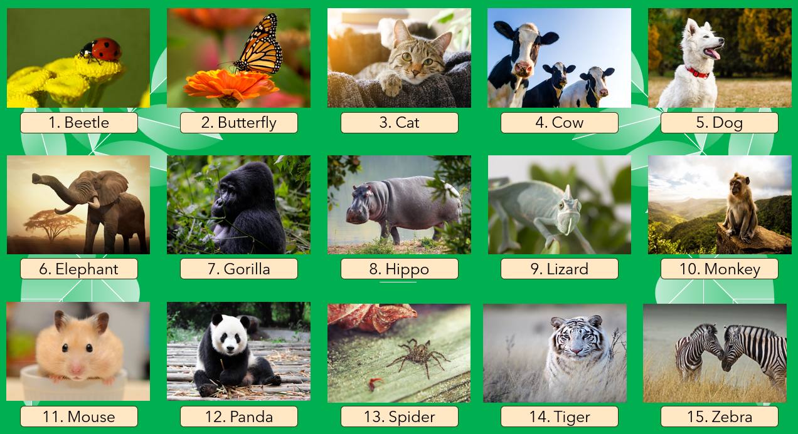
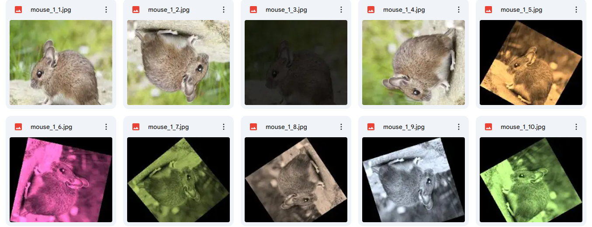
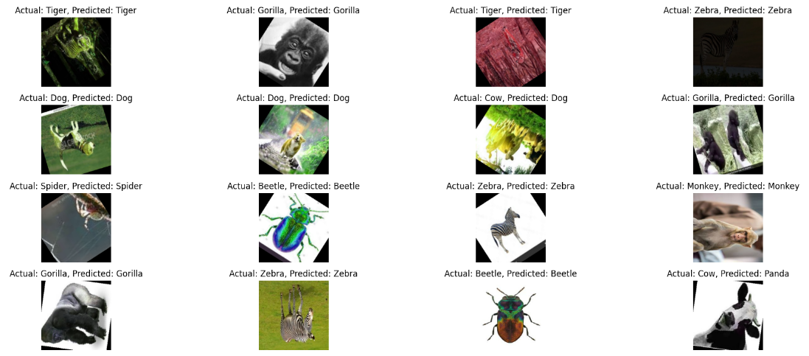
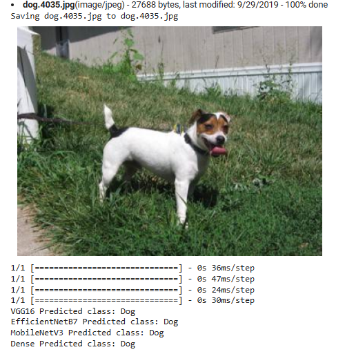

## HUẤN LUYỆN, TĂNG CƯỜNG, KIỂM THỬ VÀ ĐỌC GHI PHÂN LOẠI CON VẬT QUA HÌNH ẢNH ỨNG DỤNG MÔ HÌNH DENSENET121
### 1. Chuẩn bị dữ liệu
 Link dataset ggDrive: https://drive.google.com/drive/folders/1eBz6Ghd1RACblx7lxNHLuDQCuuMPdMLn?usp=sharing  
 Bộ dữ liệu bao gồm tổng cộng 9750 tệp hình ảnh, được chia thành hai tập chính:
 - Tập huấn luyện chứa 8775 hình ảnh thuộc 15 lớp động vật khác nhau
 - Tập kiểm thử chứa 975 hình ảnh thuộc cùng 15 lớp này.
 
 
>Đảm bảo số lượng hình ảnh mỗi class tương đương nhau  
#### Tăng cường hình ảnh  
- Các kỹ thuật này bao gồm tô đen, xoay và thay đổi màu sắc của ảnh để tạo ra các biến thể khác nhau từ ảnh gốc.  
- Những thay đổi này giúp tạo ra nhiều mẫu huấn luyện khác, làm phong phú thêm tập dữ liệu và cải thiện khả năng tổng quát hóa của mô hình.
-    

>Dùng file duplicate_images.py
### 2. Xây dựng và huấn luyện mô hình 
Các mô hình được xây dựng với các thông số cài đặt giống nhau.  
Riêng với DenseNet121 tập train và test được sử dụng thêm kỹ thuật Normalization.
>Mô hình đã được huấn luyện https://drive.google.com/drive/folders/17R0RBZUz0u-zG-fS68CypWUPtNYHN5jI?usp=sharing
### 3. Đánh giá mô hình
#### 3.1 DenseNet121 trên tập Test
   
   

 #### 3.1 So Sánh DenseNet121 với các mô hình khác
 So sánh chỉ dựa trên thiết lập các thông số giống nhau khi huấn luyện các mô hình.  
•	Accuracy: Độ chính xác là tỷ lệ dự đoán đúng trên tổng số dự đoán.  
•	Precision: Tỷ lệ các dự đoán đúng trong số các dự đoán là đúng.  
•	Recall: Tỷ lệ các dự đoán đúng trong số các mẫu thực sự đúng.  
•	F1-score: Trung bình hài hòa của precision và recall.  

Link Kagle https://www.kaggle.com/code/thuylinhuit/thuylinh-final
